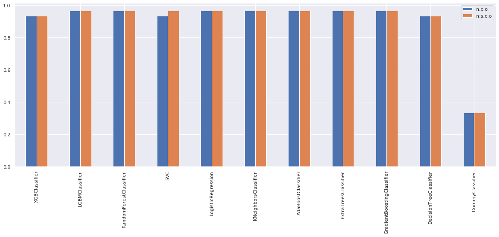

A tool to evaluate the performance of various machine learning algorithms and preprocessing steps to find a good baseline for a given task.

## Installation

```sh
pip install evaluate
```

## Example

```py
import evaluate
from sklearn import datasets

data = datasets.load_iris()
x, y = data.data, data.target

results = evaluate(task='classification', data=(x, y))
results['test_score'].plot.bar()
```



## Documentation

This tool performs common preprocessing steps such as feature scaling, one-hot encoding etc., and runs various ML algorithms such as Random Forests, SVM etc. It then evaluates the performance of each preprocessing step and ML algorithm and provides scores for each. These results can be used to quickly identify preprocessing steps and ML algorithms that perform well to form a good baseline which can be used to develop better models.

```py
evaluate(task,
         data,
         test_data=.2,
         columns=None,
         preprocessors=None,
         estimators=None)
```

###### Args

-   `task`: `'classification'` or `'regression'`
-   `data`: Tuple of `x, y` used for training the model
-   `test_data`: Tuple of `x, y` or a number representing the proportion of `data` to be used for scoring the model
-   `columns`: Dictionary of lists mapping column types to column names. If not specified numeric and categorical columns are automatically identified
-   `preprocessors`: List of names of available preprocessors or a custom `Preprocessors` object
-   `estimators`: List of names of available estimators or a custom `Estimators` object

###### Returns

Dictionary of pandas DataFrames with estimator names as index and preprocessor names as column names with the following keys:

```py
{
    'test_score': ...,
    'train_score': ...,
    'fit_time': ...,
    'score_time': ...,
}
```

```py
results = evaluate(...)
assert isinstance(results, dict)
scores = results['test_score']
assert isinstance(scores, pandas.DataFrame)
scores.plot.bar()
```

### Preprocessors

#### Available Preprocessors

| Name  | Column Type | Description                                              |
| ----- | ----------- | -------------------------------------------------------- |
| n     | numeric     | Handle missing data                                      |
| n:s   | numeric     | Standardize features                                     |
| c     | categorical | Handle missing data and perform one-hot encoding         |
| o     | ordinal     | Handle missing data and perform ordinal encoding         |
| t:c   | text        | Convert to a matrix of token counts                      |
| t:c=2 | text        | Convert to a matrix of token counts including bigrams    |
| t:t   | text        | Convert to a matrix of TF-IDF features                   |
| t:t=2 | text        | Convert to a matrix of TF-IDF features including bigrams |

Multiple preprocessors can be combined into one by separating them with `,`:

```py
results = evaluate(..., preprocessors=['n,c,o', 'n:s,c,o'])
```

#### Custom Preprocessors

Custom preprocessors can be added as:

```py
from evaluate import evaluate, Preprocessors

preprocessors = Preprocessors()
preprocessors.add('custom_preprocessor', CustomPreprocessor())
results = evaluate(..., preprocessors=preprocessors)
```

Name of the custom preprocessor must be unique.

### Estimators

#### Available Estimators

| Classification             | Regression                |
| -------------------------- | ------------------------- |
| XGBClassifier              | XGBRegressor              |
| LGBMClassifier             | LGBMRegressor             |
| RandomForestClassifier     | RandomForestRegressor     |
| SVC                        | SVR                       |
| LogisticRegression         | LinearRegression          |
| KNeighborsClassifier       | KNeighborsRegressor       |
| AdaBoostClassifier         | AdaBoostRegressor         |
| ExtraTreesClassifier       | ExtraTreesRegressor       |
| GradientBoostingClassifier | GradientBoostingRegressor |
| DecisionTreeClassifier     | DecisionTreeRegressor     |
| DummyClassifier            | DummyRegressor            |

#### Custom Estimators

Custom estimators can be added as:

```py
from evaluate import evaluate, Estimators

estimators = Estimators(task='classification')
estimators.add('custom_estimator', CustomEstimator())
results = evaluate(..., estimators=estimators)
```

Name of the custom estimator must be unique.
